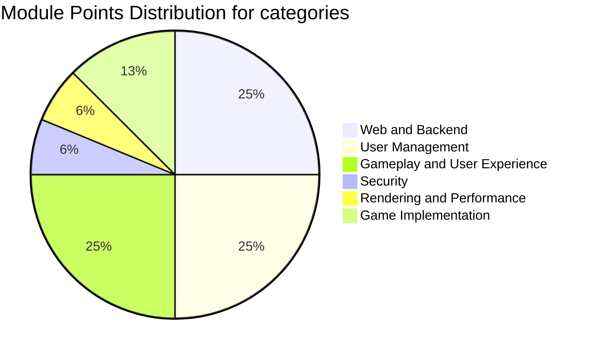
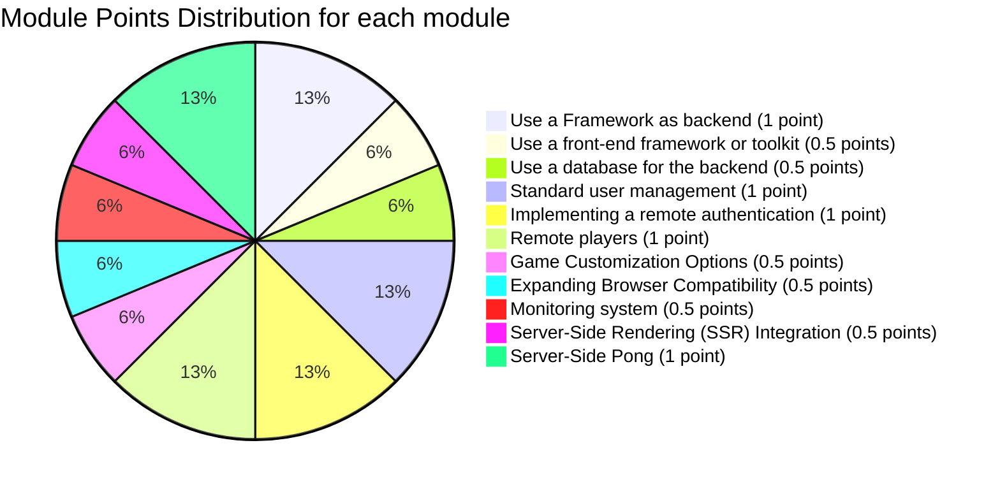

# Project Overview

The modules are labeled as either major (*[1]*) or minor (*[½]*) components.

## Web and Backend

- *[1]* [**Use a Framework as backend**](modules/md-framework-backend.png): Implemented using Django, providing a structured and scalable backend architecture.
- *[½]* [**Use a front-end framework or toolkit**](modules/md-frontend-framework.png): Bootstrap was utilized to enhance the frontend design and responsiveness.
- *[½]* [**Use a database for the backend**](modules/md-database.png): PostgreSQL was used to manage and maintain data consistency across the application.

## User Management

- *[1]* [**Standard user management, authentication, users across tournaments**](modules/md-user-management.png): Includes user registration, profile management, and game history tracking.
- *[1]* [**Implementing a remote authentication (with 42 and Google)**](modules/md-OAuth.png): OAuth 2.0 integration for secure and convenient user authentication.

## Gameplay and User Experience

- *[1]* [**Remote players**](modules/md-remote-players.png): Supports gameplay between players on different devices.
- *[½]* [**Game Customization Options**](modules/md-game-customization.png): Offers features such as power-ups, attacks, and different maps to enhance gameplay.
- *[½]* [**Expanding Browser Compatibility**](modules/md-browser-compatability.png): Ensures the application works seamlessly across different web browsers.

## Security

- *[½]* [**Monitoring system**](modules/md-monitoring-system.png): Implements Prometheus and Grafana for real-time system monitoring and alerting.

## Rendering and Performance

- *[½]* [**Server-Side Rendering (SSR) Integration**](modules/md-ssr.png): Enhances performance by pre-rendering content on the server for faster page loads.

## Game Implementation

- *[1]* [**Server-Side Pong**](modules/md-server-side-pong.png): Replaces the basic Pong game with a server-side version, enhancing gameplay through API integration.

## Total Points Calculation

Each major module contributes 1 point, and each minor module contributes 0.5 points.

- **Major Modules (6 points):** 6 major modules x 1 point each
- **Minor Modules (3 points):** 6 minor modules x 0.5 points each
- **Total:** 9 points

## Modules Breakdown Pie Chart

